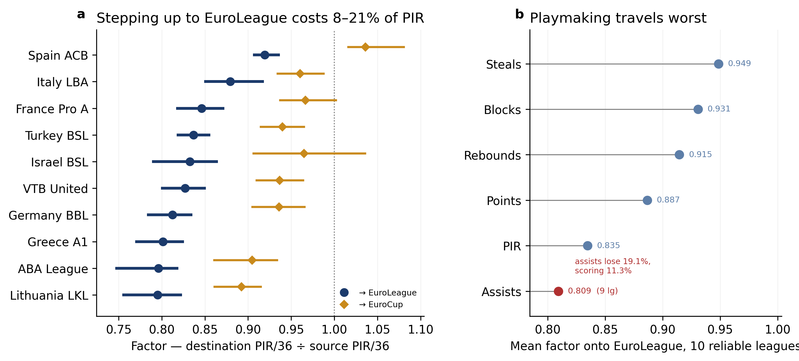

# Cross-league translation factors: what production becomes

**Date:** 2026-08-15 (first fit); see the Corpus line for the regeneration date
**Corpus:** destination side = EuroLeague API box scores, EFF from components (Amendment 4, ATI-2957); domestic side = Proballers. Regenerated 2026-09-04T11:54:14+00:00. Pairs with a 2015 destination season (603 on the Proballers-side table) drop because the API holds no 2015-16.
**Issue:** [ATI-2798](https://linear.app/ati02/issue/ATI-2798) (science),
[ATI-2827](https://linear.app/ati02/issue/ATI-2827) (the estimator in code)
**Code:** `scripts/build_league_factors.py` ->
`data/processed/translation/league_factors.parquet`
**Controls:** `scripts/report_league_factors.py` (this note is its output)

Every number below is computed by committed code from the corpus on disk. The
factor table in
`docs/superpowers/specs/2026-08-04-player-translation-projection-design.md` §3 was
not — it came from an ad-hoc session and did not reproduce under any
reconstructable filter (ATI-2827). Treat this note as superseding it.

## What a factor is

A factor is the ratio of a player's continental per-36 production to his
domestic per-36 production **in the same season**. Multiply a source-league rate
by the factor to get the expected destination rate. 0.86 means a player's PIR/36
should be expected to fall 14% when he steps up.

The identification comes from an accident of European basketball: some clubs
play a domestic league and a continental competition simultaneously, so the same
player, same season, same body, same coach produces on both sides. The player is
his own control. This is what a consecutive-season transfer study cannot do,
because players move *because* they improved or declined.

## Sample

**4,074 qualifying player-season pairs** at >=8 games each side, all
of them. There is no role-stability filter on the primary sample, which is a
change from the first version of this note and was made on evidence rather than
preference.

The old primary kept only the 3,284 pairs with |d usage| <= 5 and
|d min/game| <= 5, on the argument that domestic nationality quotas give some
players a domestic role they did not earn. That filter was tested and dropped:

- **It had no predictive value.** Across 16 out-of-sample splits, fitting on
  role-stable versus all pairs differed by a mean -0.003% RMSE (t-test p = 0.97).
- **It cut on noise.** Delta-usage has a split-half reliability of 0.31, so 69% of
  its variance is measurement error — and the cut sat at 5 against an sd of 3.4.
- **It cost three reliable cells.** Israel BSL on both destinations and Poland ->
  EuroCup clear the 75-pair bar without it (12 -> 15 of 16 cells).
- **It did not do what it was for.** The quota rationale predicts discarded pairs
  carry *inflated* domestic usage. On Israel — the league the rationale was
  written about — discarded pairs have usage 1.03 points **lower**, and the
  cross-league mean gap is +0.07.
- **It biased the factor upward.** Discarded pairs are statistically identical on
  the source side (Cohen's d = -0.005, p = 0.76) but translate far worse (median
  ratio 0.802 vs 0.894), and 55% of them are players who *lost* minutes stepping
  up against 23% who gained. That is the treatment effect, not a confound;
  removing it censored the weak tail and inflated every factor.

Dropping it moved 7 of 8 EuroLeague cells reliable under both
samples **down**, by at most 0.0181 — inside the +/-0.05 this note
quotes a reliable factor to. (The exception is aba-league at +0.0031.) Cells that only became reliable after the change move
more, as expected: Israel BSL by -0.0324. The role-stable cuts still run
as sensitivities below.

Per-league-season counts are in `league_factor_sample_sizes.parquet` so the
sample can be reconstructed rather than trusted.

## PIR/36 onto EuroLeague

| Source league | Factor | 95% CI | SE | Pairs | Clusters | Reliable |
|---|---|---|---|---|---|---|
| spain-acb | 0.919 | [0.907, 0.935] | 0.007 | 487 | 48 | yes |
| italy-lba | 0.879 | [0.851, 0.917] | 0.017 | 183 | 21 | yes |
| france-pro-a | 0.846 | [0.818, 0.871] | 0.013 | 173 | 22 | yes |
| turkey-bsl | 0.837 | [0.819, 0.855] | 0.009 | 273 | 34 | yes |
| israel-bsl | 0.833 | [0.790, 0.863] | 0.018 | 113 | 15 | yes |
| vtb | 0.827 | [0.801, 0.849] | 0.012 | 172 | 17 | yes |
| germany-bbl | 0.812 | [0.784, 0.834] | 0.012 | 211 | 19 | yes |
| greece-a1 | 0.801 | [0.771, 0.824] | 0.014 | 213 | 25 | yes |
| aba-league | 0.796 | [0.748, 0.818] | 0.018 | 183 | 18 | yes |
| lithuania-lkl | 0.795 | [0.756, 0.822] | 0.017 | 119 | 10 | yes |

## PIR/36 onto EuroCup

| Source league | Factor | 95% CI | SE | Pairs | Clusters | Reliable |
|---|---|---|---|---|---|---|
| spain-acb | 1.036 | [1.016, 1.081] | 0.016 | 326 | 39 | yes |
| greece-a1 | 0.981 | [0.933, 1.043] | 0.028 | 53 | 10 | **no** |
| france-pro-a | 0.966 | [0.937, 1.002] | 0.017 | 205 | 29 | yes |
| israel-bsl | 0.965 | [0.906, 1.036] | 0.033 | 77 | 12 | yes |
| italy-lba | 0.960 | [0.934, 0.988] | 0.014 | 256 | 31 | yes |
| turkey-bsl | 0.940 | [0.915, 0.965] | 0.013 | 221 | 31 | yes |
| vtb | 0.937 | [0.910, 0.964] | 0.014 | 142 | 16 | yes |
| germany-bbl | 0.936 | [0.905, 0.966] | 0.016 | 230 | 26 | yes |
| aba-league | 0.905 | [0.861, 0.934] | 0.019 | 289 | 30 | yes |
| lithuania-lkl | 0.892 | [0.861, 0.915] | 0.014 | 148 | 16 | yes |

`factor` is partially pooled toward the destination-tier mean; `factor_raw` on
the artifact is unshrunk. **Where `reliable` is false, use the tier mean, not
the row** — that is the refusal, and it is part of the credibility. Currently
unreliable: greece-a1->eurocup (n=53).

## Could the machinery have produced this from nothing?

The single most important check here, because a translation factor is a ratio and
ratios manufacture effects. Split ONE competition's games into two random halves
and run the identical estimator: the true factor is exactly 1.000, so anything
else is machinery rather than basketball.

| Estimator | Placebo (truth = 1.000) |
|---|---|
| `exposure_weighted` | 1.0427 |
| `ratio_of_sums` | 0.9990 |
| `mean_of_ratios` | 1.0691 |

The pooled estimator is clean. **The per-pair estimators are biased upward** —
E[X/Y] exceeds E[X]/E[Y] when the denominator is noisy — and the bias worsens as
exposure thins (1.175 below 150 minutes on the thinner side).

That does *not* license a signed correction to the factors above, and this is
worth stating precisely because the intuitive inference is wrong. Holding weights
fixed on the real pairs, the per-pair form sits about **0.020 below**
ratio_of_sums, not above it: a player's source rate correlates −0.18 with his own
ratio, and ratio_of_sums implicitly weights by source volume, so it up-weights
high-rate players who translate worse. The two effects oppose each other, neither
dominates, and the sign of the gap is league-specific — the primary is *below*
ratio_of_sums in 5 of 7 leagues. Estimator choice cannot be corrected away; it has
to be reported, which is what the `est_*` columns are for.

**Consequence for the intervals: the estimator spread is 2.08x the
bootstrap SE at the median, larger than it in 9 of 10
leagues.**
The quoted 95% CIs describe sampling noise only. Methodological uncertainty is the
larger component and is not inside them, and the synthetic study
(`translation-estimator-synthetic-validation-2026-09-04.md`, S2/S4) adds a +0.03
upward null bias that does not shrink with n and 95% intervals that realise 0.77.
**Treat a reliable factor as good to roughly ±0.05**, not ±0.03 and not the
±0.01 the bootstrap alone would suggest.

## Is the sample big enough? (per claim, not in aggregate)

"Enough" has a different answer for each thing this note is used for, so it is
answered per claim rather than by quoting a corpus size.

| Claim | Verdict |
|---|---|
| Factor vector replicates | **Yes.** Split-half r = 0.84 across random halves (0.71–0.94 at the 5th–95th percentile), Spearman-Brown 0.91; r = 0.61 splitting 2015-2020 against 2021-2025 |
| League *ordering* | **Yes**, as an ordering. The observed spread across leagues is 0.136, roughly 1.6x the 0.087 gap detectable at 80% power |
| Any *individual* pair of adjacent leagues | **Often no.** Only 13 of 45 league pairs separate at 95% once estimator uncertainty is included; italy-lba / france-pro-a / turkey-bsl / israel-bsl / vtb / germany-bbl / greece-a1 / lithuania-lkl / aba-league form one cluster that must not be read as ranked |
| A single player's projection | **No.** Player-level SD of the ratio is 0.165, so one player sits within roughly ±0.32 of his league factor. Source league explains 7.1% of player-level variance |
| Thin cells (n < 75) | **Refused by construction.** Subsampling the one large cell shows p90 error 0.038 at n=50 and 0.027 at n=75, so the threshold is 75 — that bounds the *sampling* term at ±0.03; with the estimator's +0.03 null bias the quoted precision is ±0.05 (synthetic study S4: no swept n up to 500 puts 80% of raw factors within ±0.03 of truth) |

The binding constraint is not the corpus (626,496 player-games) — it is
the number of players who cross tiers *in one season*, which is a few hundred per
year and cannot be increased by scraping more history.

## Do the factors compose? (out-of-sample)

If these numbers measure competition difficulty, they must be transitive: for any
source league, factor(L→EuroLeague) ÷ factor(L→EuroCup) should equal the
EuroCup→EuroLeague step. That step is measurable **directly** on the
11 players who cleared 8 games in both cups in one season — a comparison the
estimator never fitted.

- Direct: **0.8794** (95% CI [0.687, 1.047])
- Implied by composing the fitted factors: **0.9072**
- Discrepancy: **+3.2%**; all 9 per-league implied values fall
  inside the direct CI: True

Nothing in the fitting forces this. It is the strongest evidence in this note that
the factors track difficulty rather than an artifact of how pairs were selected —
though the direct estimate rests on 57 players, so it constrains the answer to a
few percent, not a fraction of one.

## Two orderings we did not put in

Nothing in the estimator encodes a prior about European basketball, so these are
checks rather than restatements:

1. **The recovered ordering reproduces the consensus league hierarchy** —
   Spanish ACB strongest, then Turkish BSL / Pro A, then Israel BSL, VTB,
   Lithuanian LKL, with Poland last.
2. **Every source league translates better into EuroCup than into EuroLeague**,
   which correctly places EuroCup as the easier destination. This holds on all
   seven leagues where both are reliable.

ACB above 1.0 into EuroCup is not an anomaly: it says the strongest domestic
league in Europe is harder than second-tier continental basketball, which is the
consensus reading.

## What travels, and what does not

Mean factor onto EuroLeague, by stat, with the basis of each row stated in the
last column. **Spain ACB's assist row is
excluded** — it returns 1.032, above parity, and ACB has a known assist-ordering
defect in its scraper (ATI-2837); a defective row must not enter a summary
statistic quoted beside sound ones. Its other stats are unaffected and remain in
the headline table.

| Stat | Mean factor | Leagues | Basis |
|---|---|---|---|
| steals | 0.949 | 10 | pooled |
| blocks | 0.931 | 10 | pooled |
| rebounds | 0.915 | 10 | pooled |
| points | 0.887 | 10 | pooled |
| pir | 0.835 | 10 | pooled |
| assists | 0.809 | 9 | pooled |

Playmaking is the outlier, and it is the commercially load-bearing one: assists
lose 19.1% stepping up against 11.3% for scoring, so a
domestic playmaker's assist line should be discounted roughly
**1.7x as hard** as the rest of his box score. Assists translate
worse than points in 8 of the 9 leagues where both clear
the 75-pair floor. A single blended "he'll lose about 10%" hides that
entirely.

PIR sits alongside assists near the bottom, but it is a composite index rather
than a skill — its level follows from the components above it.

## Where the clustered bootstrap actually mattered

ATI-2827 required the bootstrap to resample (season x destination club) clusters
rather than pairs, on the reasoning that club concentration would make a pair
bootstrap understate the SE. Concentration is real — two cells draw every pair
from one destination club — but it only inflates a standard error if pairs
*within* a club are correlated, so that is measured rather than assumed:

| Source -> destination | Pairs | Clusters | ICC | SE design effect |
|---|---|---|---|---|
| israel-bsl -> eurocup | 56 | 8 | +0.1999 | 1.48x |
| greece-a1 -> euroleague | 119 | 18 | +0.1341 | 1.32x |
| israel-bsl -> euroleague | 61 | 11 | +0.1008 | 1.21x |
| germany-bbl -> eurocup | 209 | 23 | +0.0392 | 1.15x |
| aba-league -> eurocup | 256 | 29 | +0.0389 | 1.14x |
| spain-acb -> eurocup | 298 | 31 | +0.0372 | 1.15x |

Median ICC across all 20 cells is +0.0046. **The premise does
not hold in general** — the pair bootstrap returns a median
0.96x the clustered SE on these headline PIR cells and
1.03x across all 806 reliable cells in the
artifact, not systematically less. It holds for exactly the cell the
spec flagged in advance: Israeli BSL, whose pairs come from two Tel Aviv clubs'
rotations, where the design effect is real. Clustering is kept because it is
correct where it matters and costs nothing where it does not — but the honest
statement is that most of these intervals would be the same either way.

## What this does not license

- **A factor is a property of the average, not of a player.** Cross-tier PIR/36
  correlates far below 1 at the player level, so an individual projection
  carries a wide interval regardless of how precisely the factor is estimated.
  Never surface a bare point estimate for one player.
- **Every factor is an upper bound for a marginal signing.** Entry requires 8
  games on both sides, so players who could not hold a continental role are
  absent by construction.
- **Not pace-adjusted.** Pace differences scale stats together, so the ordering
  survives, but the absolute factors carry a pace component. This is a
  limitation, not a caveat — there is no pace data to test it with.
- **The Israeli factor still mixes in quota effects.** Role-stability removes
  most of it; real nationality (ATI-2766) is needed to close it.

## Specification

**Question:** How does box-score production in each European source league translate onto EuroLeague and EuroCup, and how precisely do we know each factor?

**Unit:** one player-season observed with >=8 games in BOTH a source league and a destination competition in the SAME season — the player is his own control

| slot | value |
|---|---|
| estimator | exposure-weighted per-pair ratio (weight = min(minutes on the two sides)); ratio-of-sums and mean-of-per-pair-ratios reported beside it |
| null | n/a: paired within-player-season design, no null reference needed |
| sample_filter | >=8 games each side; primary sample is 'all_pairs' (the role-stability cut was demoted to a sensitivity — see Sample) |
| key | player_name + season (Proballers has no stable person id) |
| unit | one player-season observed with >=8 games in BOTH a source league and a destination competition in the SAME season — the player is his own control |
| corpus | domestic side: data/raw/proballers + data/raw/_inactive_leagues/proballers; destination side: EuroLeague API box scores (data/raw/{euroleague,eurocup}/<season>/boxscores, EFF from components, seasons 2016-2025; Amendment 4); 626,496 player-games after de-duplication |
| excluded_leagues | none — the full corpus as globbed |
| pir_source | pir column used directly, 0.00% null since ATI-2826 |
| pooling | empirical-Bayes shrinkage toward the destination-tier mean; reliable = false below 75 pairs |
| source_leagues | continental cups excluded as sources: ['bcl', 'test', 'euroleague', 'eurocup'] |
| uncertainty | cluster bootstrap over (season x destination club), 2000 resamples — NOT over pairs |

## Invariants

| check | detail | |
|---|---|---|
| dual_tier_pairs | 4,074/4,074 matched (100.0%), no fan-out | ok |
| pair_count_two_ways | a=4,074 == b=4,074 | ok |

## Estimator sensitivity

| quantity | estimator | value | |
|---|---|---|---|
| pir_factor_turkey-bsl_to_euroleague | exposure_weighted | 0.8546 | spread 0.014 — stable |
|  | mean_of_ratios | 0.8463 |  |
|  | ratio_of_sums | 0.86 |  |

## Threats and controls

| threat | control |
|---|---|
| estimator_choice | 3 estimators compared on 'pir_factor_turkey-bsl_to_euroleague' |
| name_collision | 487 of 3284 role-stable pairs (14.8%) use a name held by >1 club in one league-season; excluding them moves the largest PIR factor by 0.0135 |
| survivorship | 1335 player-seasons reached a destination competition but under 8 games and are absent by construction; because the censored group is the one that failed to hold a continental role, every factor here is an upper bound on the translation a marginal signing should expect |
| sample_filter | >=15 games each side leaves 2166 role-stable pairs (vs 3284 at >=8) and moves the EuroLeague PIR factors by at most 0.0067; >=5 games gives 3534 pairs and moves them by at most 0.0043. The league ordering is unchanged under both. |
| unit_ambiguity | pair_count_two_ways: a=4,074 == b=4,074 |
| system_vs_player | pairs concentrate on destination club — the most concentrated cell is lithuania-lkl->euroleague at 100% from one club. But concentration only inflates an SE if pairs within a club are correlated, and measured they mostly are not: median ICC of the per-pair ratio is 0.0046 across 20 cells, so the pair bootstrap returns a median 0.96x the clustered SE on the headline PIR cells and 1.03x across all reliable cells — either way not systematically less. The exception is the cell the spec predicted: israel-bsl->eurocup at ICC 0.200, a design effect of 1.48x on the SE. Clustering is retained because it is right where it matters and costs nothing where it does not |
| machinery_artifact | PLACEBO — one competition's games split into two random halves (19,177 player-seasons, true factor exactly 1.000) returns exposure_weighted=1.0427, ratio_of_sums=0.9990, mean_of_ratios=1.0691. ratio_of_sums is unbiased; the per-pair estimators are biased UPWARD, worsening as exposure thins (1.175 below 150 minutes) because E[X/Y] exceeds E[X]/E[Y] when the denominator is noisy. CRUCIALLY this does NOT transfer to a signed correction on real data: holding weights fixed, the per-pair form sits 0.040 BELOW ratio_of_sums there, because a player's source rate correlates -0.25 with his own ratio (regression to the mean) and ratio_of_sums implicitly weights by source volume, up-weighting high-rate players who translate worse. The two effects oppose each other, and on the current corpus the estimator gap runs ONE WAY on every reliable cell (10 of 10 leagues have the primary below ratio_of_sums), so it is a systematic offset rather than noise — either way it cannot be corrected away by switching estimator, so it must be reported. NOTE the gap measured here is exposure asymmetry between the two sides, not the E[X/Y] bias the placebo shows: weighting a mean of ratios by its own denominator removes that bias exactly (see source_volume_weighted) |

## Null references

| reference | result |
|---|---|
| same-competition split, ratio_of_sums | real +0.835 vs null +0.999 -> gap -0.164 |
| same-competition split, exposure-weighted (primary) | real +0.835 vs null +1.043 -> gap -0.208 |

## Caveats, tested

| caveat | what happened |
|---|---|
| the role-stable cut at 5 usage points is a chosen threshold, not physics | re-estimated at 3, 7 and no cut: mean reliable EuroLeague PIR factor all_pairs 0.835, role_stable_3 0.867, role_stable_5 0.848, role_stable_7 0.839 — a spread of 0.032, and the league ordering does not change |
| the Israeli factor may mix league difficulty with quota-driven role loss | split by the homegrown proxy on ALL Israeli pairs: homegrown-proxy n=26 d_usage -1.21, import-proxy n=164 d_usage -0.61. The role-stability filter was previously justified as the fix for this, but it fails the quota story's own prediction: pairs it discarded carry domestic usage 1.03 points LOWER than pairs it kept, where the quota mechanism requires higher. The filter was removing role-losers, not quota-protected players. So the confound is NOT controlled here — real nationality (ATI-2766) is required, and until then the Israeli factor carries this openly |
| BCL was excluded as a source league, which could hide a real league | BCL is a parallel continental cup, not a source league: 182 of its 328 club-seasons (55%) also appear in a domestic league the same season, so a 'BCL factor' would compare two continental competitions rather than answer 'what does this league's production become'. Only 3 pairs would have qualified anyway |
| factors may drift across eras, so a pooled figure could be stale | re-estimated by era: 2015-2019 mean 0.840 over 4 reliable leagues, 2020-2025 mean 0.844 over 7 reliable leagues — both eras are on the artifact as separate rows, so a consumer can use the recent one |

## What this block does NOT cover

- free-text threats with no computed control: machinery_artifact

## Conclusion

Production translates onto EuroLeague at 0.80-0.92 of its source-league per-36 rate depending on the league, and the recovered ordering reproduces the consensus European hierarchy without any prior encoding it [via: external_validity]. Because pairs concentrate on a few destination clubs, the intervals come from a cluster bootstrap rather than a pair bootstrap [control: system_vs_player]. Every factor is an upper bound for a marginal signing, since a player who could not hold an 8-game continental role never enters the sample [control: survivorship].
