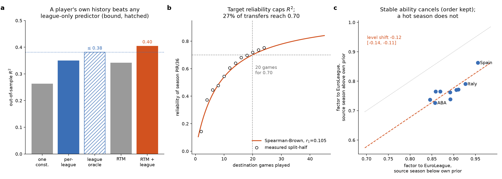

# Five propositions behind the cross-league translation model

**Date:** 2026-09-04 · **Status:** exploratory, **not pre-registered** (see "Standing" below) ·
**Generator:** `scripts/instantiate_translation_propositions.py` (default arguments;
`--continental-source api`, the Amendment 4 default) · **Tests:**
`tests/test_scripts/test_instantiate_translation_propositions.py` · **Machine-readable values:**
`data/processed/translation/propositions.json` (regenerated, not committed — same rule as the rest
of that directory).

**Answer.** Three results the Sloan draft states as empirical nulls — the per-league factor table
adds little over one constant, no model reaches an R² above about 0.7, a hot source season predicts
a worse translation — are each a short, provable inequality plus one number measured from the
corpus. Measured on the same 674 walk-forward transfers as the paper's comparator table: league
identity alone cannot lift out-of-sample R² above **0.381** (the league-only oracle), and RTM +
per-league reaches **0.404** by using the player's own history; the target's reliability at the
scored exposure is **0.696**, so the best arm explains **60%** of the variance that is explainable
at all; and the two-way fixed-effects level for a move into EuroLeague is **0.122 lower** (95% CI
[−0.140, −0.107]) when the source season beat the player's own prior than when it did not, while the
ordering of the ten leagues is the same in both halves (Spearman 0.867).

## Specification

| Choice | This analysis | Alternatives printed |
|---|---|---|
| **Unit** | P1–P3: one (player, destination season) transfer scored by the walk-forward (n = 674); P4–P5: one same-season dual-tier pair, source rate > 0 (n = 4,072, 20 cells) | — |
| **Population** | exactly the rows of `scripts/validate_translation_walkforward.py` — folds rebuilt through `one_season` / `_fit_rtm_arms` / `fold_rows`; the five arm MAEs must reproduce `walkforward_summary.json` to 1e-6 or the script stops | — |
| **Estimator** | P1: in-sample least-squares cell multiplier `m_c = Σs·y / Σs²` (the oracle for `src × multiplier`); P2: odd/even split-half reliability on the destination season, Spearman–Brown stepped up; P4: exposure-weighted (`min(minutes)`) two-way fixed effects on `log(dest/src)`, EuroLeague pinned at 0 | P1 ratio-space bound `η²·Var(R)` beside the destination-unit oracle; P3 r₁ three ways (single-game split, corpus inversion, least-squares fit) |
| **Null / bound** | each proposition IS the bound: P1 oracle MSE ≤ shipped per-league MSE; P2 every arm's Corr² ≤ reliability; P5 identity to 1e-10 on every cell — all three are in-script `assert`s | P4: hot vs cold split, cluster-bootstrap CI on the level shift |
| **Uncertainty** | cluster bootstrap on destination club-season, seed 0: 2,000 draws for η², 500 for the level shift | — |
| **Falsifier** | P3 is a testable assumption: split-half reliability from the first 2k games only, k = 1…12, against the one-parameter curve | — |

**Reproducibility.** `python scripts/instantiate_translation_propositions.py` from repo defaults
prints every figure below and writes `propositions.json` and the figure. It needs
`data/processed/translation/walkforward_summary.json` from a prior walk-forward run, because
the first thing it does is prove it is standing on the same rows. Repository state: branch off
`main` at 87e23110c.

**Standing.** This note is exploratory and was written after the walk-forward result, not before
it. The pre-registration convention in `docs/research/METHOD.md` asks that a new comparator arm
(the league-only oracle) and a new split (hot/cold source season) be recorded as a dated, additive
amendment before they are cited in the publication. Whether to record them that way, or to keep
this note as a derivation that explains numbers already on record, is **Amir's decision** and is
not made here.

## Why this note exists

The Sloan draft currently makes three of its main points as empirical nulls. Each is in fact a
consequence of a short inequality plus one number measured from the corpus. Stating them as
propositions changes what the paper claims — from "we did not find it" to "it cannot exist beyond
this bound, and here is the bound" — and it tells the reader exactly which assumption the
regression-to-the-mean (RTM) term is repairing. The propositions are elementary; the value is in
attaching them to the right measured quantity.

Notation. A player-season pair has source rate `s` (PIR per 36 in the domestic league),
destination rate `y` (PIR per 36 in EuroLeague or EuroCup), realised translation ratio
`R = y / s`, and league cell `L` (source league × destination). Expectations are over the
population of pairs; `Var` and `Cov` are population moments (divide by n).

*Panel a: out-of-sample R² per arm on the 674 scored transfers, with the league-only oracle
(in-sample bound, hatched). Panel b: measured split-half reliability at 2…24 games against the
Spearman–Brown curve, r₁ = 0.105. Panel c: factor to EuroLeague per league, source season above vs
below the player's own prior; the dashed line is the identity shifted by −0.122.*

---

## Proposition 1 — League identity bounds what any league-only predictor can gain

**Statement.** Let `g(L)` be any predictor of `R` that depends on the league cell only. Then

    MSE(constant E[R]) − MSE(g(L)) ≤ Var(E[R | L]) = η² · Var(R),

with equality when `g(L) = E[R | L]`. Here η² is the between-cell share of the variance of `R`.

**Proof.** By the law of total variance, `Var(R) = E[Var(R|L)] + Var(E[R|L])`. For any `g`,
`E[(R − g(L))²] = E[Var(R|L)] + E[(E[R|L] − g(L))²] ≥ E[Var(R|L)]`, because the cross term
vanishes (`E[R − E[R|L] | L] = 0`). So `MSE(g) ≥ Var(R) − Var(E[R|L])`, and the constant predictor
has `MSE = Var(R)`. Subtract. ∎

In Lean/Mathlib this is the L² projection property of conditional expectation
(`MeasureTheory.condExp`, `condExpL2` as an orthogonal projection).

**Measured.**

| population | n | cells | SD(R) | η² raw [95% cluster CI] | η² bias-corrected (ω²) | bound Var(E[R∣L]) |
|---|---|---|---|---|---|---|
| same-season dual-tier pairs (factor table is fitted here) | 4,072 | 20 | 0.263 | 8.7% [7.2, 11.2] | 8.2% | 0.0060 |
| walk-forward scored transfers (what is predicted) | 674 | 20 | 0.280 | 14.5% [11.4, 22.5] | 12.0% | 0.0113 |

On the scored transfers, in ratio space: constant 0.0782 → walk-forward per-league factors 0.0720,
a gain of 0.0089 against the bound of 0.0113 — **the shipped table already extracts 79% of the
maximum a league-only predictor can ever extract.** (The walk-forward global scalar, 0.0809, is
slightly worse than the in-sample mean because it is fitted on prior seasons.)

The paper's metric is in destination units, `ŷ = s · g(L) · K`. For that multiplicative form the
in-sample least-squares cell multiplier `m_c = Σ s·y / Σ s²` is the exact oracle, so its in-sample
error is a lower bound on the out-of-sample error of *any* predictor of that form:

| arm (n = 674) | MAE | MSE | out-of-sample R² |
|---|---|---|---|
| untranslated source rate (B0) | 3.887 | 24.78 | −0.037 |
| one global scalar | 3.291 | 17.63 | 0.263 |
| per-league factors (walk-forward) | 3.087 | 15.56 | 0.349 |
| **league-only oracle (in-sample bound)** | **2.996** | **14.79** | **0.381** |
| regression to the mean, no league | 3.116 | 15.76 | 0.341 |
| **RTM + per-league** | **2.942** | **14.24** | **0.404** |

Realised MSE gain from league identity 2.07 versus an oracle ceiling of 2.83 (73%). The
combined RTM + league arm, fitted out of sample, beats the league-only *oracle*. That is the
sentence the proposition licenses: **no predictor of the form `source × league multiplier`,
however well its 20 cells are estimated, can reach R² 0.381 on these transfers; adding the
player's own history reaches 0.404.**

*Correction to an earlier figure.* Earlier sessions recorded η² = 4.0% "between leagues" (the
figure `validate_translation_walkforward.py`'s docstring still carries). That was measured on the
Proballers-destination corpus. On the current API-destination corpus it is 8.7% (pairs) and 14.5%
(scored transfers, wider CI). The qualitative claim — most of the variance is player-to-player
within a cell — stands; the number in the paper must be the current one.

*Correction to the session draft of this note.* The session draft gave the oracle ceiling in
destination units as 2.73 and the realised share as 76%. The script computes 17.63 − 14.79 =
2.83 and 2.07 / 2.83 = 73%; the draft's figure was an arithmetic slip, corrected here in place.

---

## Proposition 2 — The reliability of the target caps every model's R²

**Statement.** Write the destination-season rate as `Y = T + e`, where `T` is the player's true
rate at that exposure and `e` is game-sampling noise with `E[e | T, X] = 0` for every predictor
input `X` known before the destination season. Then for any predictor `f(X)`,

    Corr(f(X), Y)² ≤ Var(T) / Var(Y) =: ρ_Y   (the reliability of Y),

and hence any calibrated model's out-of-sample R² is at most ρ_Y.

**Proof.** `Cov(f, Y) = Cov(f, T) + Cov(f, e) = Cov(f, T)` since `E[e | X] = 0`. By Cauchy–Schwarz,
`Cov(f, T)² ≤ Var(f) Var(T)`. Therefore `Corr(f, Y)² = Cov(f, T)² / (Var(f) Var(Y)) ≤ Var(T)/Var(Y)`.
For a calibrated predictor, `R² = Corr²`; in general `R² ≤ Corr²`. ∎

Mathlib: Cauchy–Schwarz in the L² inner-product space (`real_inner_mul_inner_self_le`).

**Measured.** ρ_Y is estimated from odd/even split halves of the destination season, stepped up
with Spearman–Brown (Proposition 3). Corpus-wide: split-half r 0.5475 at 10.3 games per half →
per-game reliability r₁ = 0.105 → ρ_Y = 0.676 at the scored rows' mean exposure of 17.8 games.
Directly on the 674 scored rows (all 674 matched to their per-game halves): split-half r 0.534
→ ρ_Y = 0.696.

| arm | Corr(f, Y) | Corr² | Corr with half A / half B | Corr² / ρ_Y (share of reliable variance) |
|---|---|---|---|---|
| one global scalar | 0.564 | 0.318 | 0.499 / 0.491 | 46% |
| per-league factors | 0.615 | 0.378 | 0.544 / 0.536 | 54% |
| regression to the mean | 0.594 | 0.353 | 0.524 / 0.522 | 51% |
| RTM + per-league | 0.648 | 0.420 | 0.572 / 0.568 | 60% |

Every arm respects the bound (Corr² ≤ 0.696), as it must — the script asserts it. The useful
reading is the last column: the best model explains 60% of the variance that is *explainable at
this exposure*; the disattenuated correlation with the player's true destination rate is
0.648/√0.696 = 0.78. Reported alone, "R² = 0.40" reads as a weak model; against the ceiling it reads
as a model that has captured most of what the target allows.

---

## Proposition 3 — Spearman–Brown, and how many games a reliable target needs

**Statement.** If game-level rates are exchangeable with per-game reliability r₁ (equal true-score
variance, independent noise of equal variance), the mean of `n` games has reliability

    ρ_n = n r₁ / (1 + (n − 1) r₁),    so    n(ρ) = ρ(1 − r₁) / (r₁(1 − ρ)).

**Proof.** With `Y_i = T + e_i`, the mean `Ȳ_n = T + ē_n` has `Var(ē_n) = σ_e²/n`. So
`ρ_n = σ_T² / (σ_T² + σ_e²/n)`. Substitute `r₁ = σ_T²/(σ_T² + σ_e²)`, i.e. `σ_e²/σ_T² = (1 − r₁)/r₁`,
and simplify. Invert for `n`. ∎

**Measured — the assumption is testable and it holds.** Taking the 1,639 destination player-seasons
with ≥ 24 games and computing split-half reliability from the first 2k games only, k = 1…12:

| games used | 2 | 4 | 6 | 8 | 10 | 14 | 18 | 20 | 24 |
|---|---|---|---|---|---|---|---|---|---|
| measured reliability | 0.143 | 0.373 | 0.446 | 0.478 | 0.545 | 0.640 | 0.697 | 0.719 | 0.752 |
| Spearman–Brown, r₁ = 0.112 | 0.201 | 0.335 | 0.430 | 0.502 | 0.557 | 0.638 | 0.694 | 0.716 | 0.751 |

The single-parameter curve tracks the measured values to within 0.025 from six games onward (the
2-game point is the noisiest and the only deviation above 0.04). The fitted r₁ = 0.112 agrees with
the corpus-wide inversion r₁ = 0.105. Games needed and how many scored transfers have them:

| target reliability | 0.60 | 0.70 | 0.80 | 0.90 |
|---|---|---|---|---|
| destination games needed | 13 | 20 | 34 | 77 |
| share of the 674 scored transfers with that many | 76% | 27% | 4% | 0% |

A reliability of 0.9 for a single continental season is unattainable — no European season is long
enough — which is why the model's target is, and should remain, a single-season rate with its
ceiling reported beside it.

---

## Proposition 4 — What the same-season design identifies, and what it does not

**Statement.** Model `log rate_{p,L,t} = α_p + β_L + ε_{p,L,t}` (player ability, league difficulty,
noise). Consider the graph whose nodes are leagues and whose edges are player-seasons observed in
two leagues in the same season.

(i) *Cancellation.* Within a pair, `log R = β_dest − β_src + (ε_dest − ε_src)`: the player term
cancels exactly, so the estimate of `β` is unaffected by *any* selection that acts through `α_p`
— including "only good players reach the EuroLeague".

(ii) *Identification.* `β` is identified up to one additive constant if and only if the league graph
is connected. Equivalently, the weighted graph Laplacian `Lap = Xᵀ W X` of the pair incidence
matrix `X` has rank (#leagues − #components).

(iii) *What survives.* Selection or conditioning that acts through `ε_src` — being paired *because*
the source season was strong — does **not** cancel; it enters the estimate as a level shift in
`β_dest − β_src`.

**Proof.** (i) is the algebra of the differenced model. (ii): the null space of the incidence matrix
of a graph is spanned by the indicator vectors of its connected components (a vector `v` with
`v_dest − v_src = 0` on every edge is constant on each component), so `rank Lap = n − c`; with one
component the only unidentified direction is the all-ones vector, i.e. one constant. (iii): the
expectation of `ε_dest − ε_src` conditional on the pairing event is `−E[ε_src | paired]`, which is
non-zero when pairing depends on `ε_src`. ∎

Mathlib: `SimpleGraph.lapMatrix` and the theorem relating the Laplacian kernel's dimension to the
number of connected components.

**Measured.**

*Identification.* 12 leagues carry pairs (BCL none). The exposure-weighted Laplacian has rank 11:
one component, so all 12 league effects are identified up to one constant. Remove the two
continental nodes and the 10 domestic leagues fall into 10 isolated components — nothing is
identified. The continental competitions are not merely the destination; they are the bridge that
makes any domestic-to-domestic comparison possible.

*The two-way fixed-effects solution* (pin EuroLeague = 0; multiplier = destination rate / source
rate for a move into EuroLeague):

| league | Spain ACB | Italy LBA | France Pro A | Israel BSL | Turkey BSL | VTB | Germany BBL | Greece A1 | Lithuania LKL | ABA |
|---|---|---|---|---|---|---|---|---|---|---|
| factor to EuroLeague | 0.905 | 0.842 | 0.829 | 0.819 | 0.811 | 0.808 | 0.797 | 0.784 | 0.767 | 0.765 |

Spearman correlation with the shipped estimator (`fit_factors`, partially pooled `factor`, refitted
on the same 4,072 pairs): 0.976 (EuroLeague cells), 0.697 (EuroCup cells). The bridge also yields
factors the corpus never observes directly, e.g. Spain ACB → Italy LBA 1.076, Germany BBL →
Spain ACB 0.880. These are consequences of connectivity, not new estimates, and carry the same
caveat as the table: adjacent rows are not separable.

*Uncertainty of an implied factor — added 2026-09-05.* The electrical reading of P4(ii) gives it
for free. Treat every pair as a conductor of conductance `w` (its exposure weight); then for any two
leagues `i, j`, observed together or not, `Var(β_i − β_j) = σ² · R_eff(i, j)`, where
`R_eff(i, j) = Lap⁺_ii + Lap⁺_jj − 2 Lap⁺_ij` is the **effective resistance** between the two nodes
in the weighted league graph and `σ²` is the weighted residual variance of the two-way fit. The
quantity does not depend on which league is pinned, and a contrast is well identified exactly when
many parallel paths join its nodes. Measured (`propositions.json: P4_identification.implied_unobserved`,
cluster-bootstrap SE on 500 club-season resamples printed beside it as the alternative):

| implied move (0 direct pairs) | factor | 95% CI (effective resistance) | SE log, R_eff | SE log, cluster bootstrap |
|---|---|---|---|---|
| Spain ACB → Italy LBA | 1.076 | [1.045, 1.107] | 0.0147 | 0.0166 |
| Germany BBL → Spain ACB | 0.880 | [0.855, 0.905] | 0.0145 | 0.0144 |
| ABA → Turkey BSL | 0.943 | [0.912, 0.975] | 0.0170 | 0.0199 |

On the ten observed domestic → EuroLeague contrasts the two standard errors agree to within a
factor of 0.74–1.29 (`domestic_to_euroleague_se`), so the closed form is a usable first read and
the bootstrap remains the reported interval where one exists. The assumption the closed form adds
is `Var(ε_i) = σ²/w_i` with independent pairs; the same player appears in several seasons, which
the club-season bootstrap absorbs and the resistance does not — where they differ, the bootstrap is
the wider one on 6 of 10 leagues. Lean: `PROOF-PATH.md` notes the formal P4(ii) uses Mathlib's
**unweighted** `lapMatrix`; the standard errors need the weighted Laplacian, which is the same
rank argument with `Xᵀ W X` in place of `Xᵀ X`.

*The failure mode, measured.* Split the 3,799 pairs that have prior history by whether the source
season beat the player's own prior-seasons rate (minutes-weighted PIR/36 over all strictly earlier
seasons in any league):

| | source season above own prior (n = 2,126) | below (n = 1,673) | difference |
|---|---|---|---|
| mean factor to EuroLeague across 10 leagues | 0.769 | 0.892 | **−0.122 [−0.140, −0.107]** |
| ordering of the 10 leagues | Spearman between the two columns: 0.867 | | |

Stable ability cancels — the *ordering* is the same in both halves — but the *level* does not: a
player paired off a hot season translates 12 points worse. The signature is the correlation of the
source rate with the realised ratio, −0.30 (−0.33 for source minus own prior). This is
Proposition 4(iii) in the data, and it is exactly the term the RTM arm supplies: a level correction
conditional on the player's own deviation from history. The paper's "complementary, not
competing" result for RTM + league is therefore not an empirical accident; the league term carries
`β` (identified by the design) and the RTM term carries the `ε_src` conditioning (which the design
cannot remove).

---

## Proposition 5 — The sign of the estimator gap is the sign of one covariance

**Statement.** For weights `w_i > 0` and ratios `r_i`,

    Σ w_i r_i / Σ w_i − mean(r) = Cov(w, r) / mean(w).

**Proof.** `Σ w_i r_i / n = Cov(w, r) + mean(w) mean(r)`; divide by `mean(w)`. ∎ (Two lines over
`Finset.sum` in Lean.)

**Measured.** The identity holds to 3 × 10⁻¹⁶ on every cell (the script asserts 1e-10). With
source-volume weights (the weights implicit in ratio-of-sums), `Cov(w, r) < 0` in 18 of 20 cells,
mean gap −0.014, mean correlation −0.10; with the primary estimator's exposure weights
`min(minutes)`, the gap is positive in 16 of 20, mean +0.009. This is why the difference between
estimators must never be described as a one-directional "ratio bias": it is a covariance whose sign
depends on which weight is chosen, and both signs occur in this corpus.

---

## What this changes in the paper

1. The comparator ladder gains a **bound**, not a bar: the **league-only oracle** is fitted
   *in-sample* on the scored rows, while the five arms are out-of-sample, so it is drawn hatched
   and labelled as a ceiling, never compared to an arm as if it were one. RTM + league clears it
   out of sample. The claim is no longer "per-league beats global" (a margin) but "league identity
   is bounded at R² 0.38 on these transfers and the player's own history is what moves past it"
   (an impossibility plus a construction).
2. Every R² is reported as a share of the reliability ceiling, with Proposition 3 justifying the
   ceiling and the 20-games figure.
3. The RTM term stops being an add-on and becomes the repair of a named identification failure
   (Proposition 4(iii)), with the level shift −0.12 [−0.14, −0.11] as its measured size.
4. Domestic-to-domestic factors can be mentioned as consequences of connectivity, with the
   ordering caveat carried over.

## What this does not change

The data, the effect sizes, or the odds. The between-league share is 8.7–14.5%, not 4%; the
ordering claim is unchanged; the poster-first strategy stands. Nothing here re-scores the
pre-registered gate (`docs/research/translation-holdout-validation-2026-08-17.md`) or the
walk-forward record (`docs/research/translation-walkforward-per-league-2026-08-21.md`).

## Limitations, stated as limitations

* The bootstrap intervals are Monte Carlo: the session draft of this note quoted [11.2, 22.2] for
  the scored-transfer η² and [−0.141, −0.107] for the level shift; the committed script gives
  [11.4, 22.5] and [−0.140, −0.107] at the same seed and draw counts. The difference is
  resampling noise in the third decimal, not a change in the estimate.
* P2's bound assumes `E[e | X] = 0` — game-sampling noise in the destination season is unrelated
  to anything known before it. Injuries and role changes that a scout could anticipate would
  violate it and would make the ceiling too low, not too high.
* P4's hot/cold split conditions on a player having any prior season in the corpus (3,799 of
  4,072 pairs); debutants are excluded from that measurement only.

## Measured 2026-09-05: the model of P4 fitted as one model

`translation-hierarchical-arm-2026-09-05.md` fits `log rate = α_p + β_L + ε` jointly (player random
effect, β from the same-season pairs) and scores it on the same 674 rows: MAE 3.110 against the
two-stage combined arm's 2.942, CI excluding zero. The two-stage pipeline stays; what the joint fit
adds is a diagnosis (league identity is attenuated by the shrinkage, and equal weight on past seasons
is the wrong prior) and a named 2027-refit candidate (a random-walk ability model).

## Next step if wanted: machine-checked versions

Propositions 1, 2 and 5 are one-page arguments whose Mathlib ingredients exist (conditional
expectation as L² projection; Cauchy–Schwarz; finite sums). Proposition 4(ii) is the graph
Laplacian rank theorem, which Mathlib also carries. Proposition 3 is algebra. A companion Lean
package would be five short files over Mathlib, buildable on a laptop; the sandbox that produced
this note has no Lean toolchain and the toolchain host is off its network allowlist, so that step
needs one approval.

## Scripts

* `scripts/instantiate_translation_propositions.py` — loads the corpus through
  `scripts.validate_translation_holdout.load_corpus()` and `build_switchers()`, rebuilds the six
  walk-forward folds through `scripts.validate_translation_walkforward.one_season` /
  `_fit_rtm_arms` / `fold_rows`, asserts the five arm MAEs against `walkforward_summary.json`
  (per-league 3.0866 / one global 3.2908 / B0 3.8865 / RTM 3.1164 / RTM + league 2.9419 at
  n = 674), then computes every number above and writes `propositions.json` and
  `translation_propositions.png`. **Committed copy (added 2026-09-06):**
  `docs/research/artifacts/translation-propositions-2026-09-04/propositions.json`, regenerated to that
  path on 2026-09-06 because the 2026-09-04 run wrote to a scratch directory that no longer exists;
  the oracle (MAE 2.996 / R² 0.381 / MSE 14.79), the combined arm (0.404), η² (8.7% / 14.5%) and the
  reproduced walk-forward MAEs are identical to the digits above. Cited in publication under
  `preregistration-2026-27-amendment-11-2026-09-06.md`.
* `tests/test_scripts/test_instantiate_translation_propositions.py` — twelve synthetic-data tests,
  each mutation-verified: the oracle multiplier minimises in-sample MSE against perturbations;
  `η²·Var(R) = Var(E[R|L])`; Corr² ≤ reliability under `Y = T + e`; Spearman–Brown inverts
  exactly; Laplacian rank = leagues − components on connected, empty and two-island graphs; the
  two-way fixed effects recover `β` with player ability cancelled; the weighted-mean identity
  holds and its sign follows `Cov(w, r)`; the reproduction gate refuses drifted folds; the three
  proposition asserts are present in the source; effective resistance adds in series, halves in
  parallel and scales with conductance; the resistance SE equals the WLS contrast SE whichever
  league is pinned.
