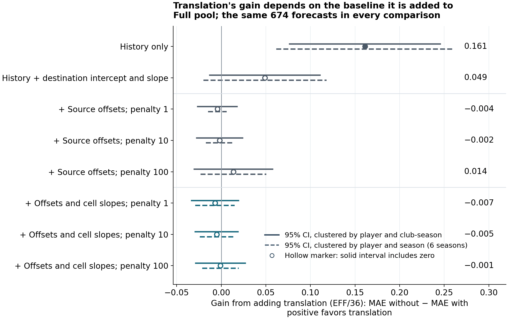
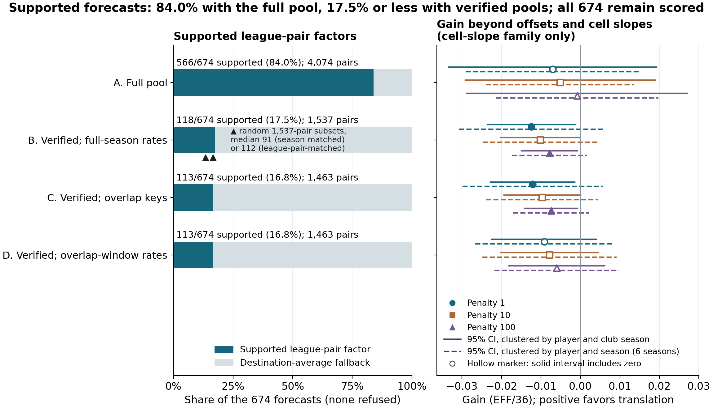

# What Does League Translation Add? A Benchmark for European Basketball Forecasts

**Introduction.** Clubs building EuroLeague and EuroCup rosters must compare players from different domestic leagues. Translation factors from players' same-season domestic and continental rates are widely used, but beating a league-blind forecast means little if a competition-aware one does as well. We ask what one translation recipe adds to competition-aware forecasts, and how stricter identity verification changes factor support.

**Methods.** Proballers domestic and EuroLeague API continental records define 674 forecasts of box-score efficiency per 36 minutes (EFF/36): 194 EuroLeague and 480 EuroCup player-seasons (2020–2025) with at least eight domestic games one season and eight continental games the next, excluding last season's continental regulars. Translation is added to four nested baselines: player history; plus destination intercept and slope; plus source-league offsets; plus source-by-destination (cell) slopes, the offset and cell-slope terms ridge-penalized at 1, 10 and 100. Factors come from the full pool and three identity-verified variants. Gain is the reduction in mean absolute error (MAE) from adding translation. Intervals (95%), clustered by player and club-season (alternatively, player and season), omit refitting uncertainty. Forecasts use only earlier seasons; all comparisons score the same 674. Outcomes were inspected earlier and verification reconstructed afterward, so comparisons are retrospective and exploratory.

**Results.** In the full pool, adding translation to player history lowers MAE from 3.096 to 2.935 EFF/36 (gain 0.161, a 5.2% reduction; interval 0.077 to 0.246). With the destination known, the gain is 0.049 (1.6%; interval −0.013 to 0.111). With source leagues modeled, full-pool gains span −0.007 to 0.014, every interval including zero (Figure 1). With verified factors, gains over history shrink to 0.044–0.083 and every competition-aware gain is negative (−0.012 to −0.005); 10 of 18 correlated source-aware player/club-season intervals exclude zero, but only 2 player/season intervals (six seasons) do. Verification cuts estimation pairs from 4,074 to 1,537 and forecasts with a supported league-pair factor (rather than a fallback) from 566 of 674 (84.0%) to 118 (17.5%; 113 with overlap trimming; Figure 2). Across random 1,537-pair subsets, registered after this loss was seen, median supported forecasts are 91 (season-matched) and 112 (also league-pair-matched, maximum 118): comparable support loss is attainable without verification; season-matched subsets lose more EuroLeague support.

**Conclusion.** Translation's value depends on the comparator: with full-pool factors, a 5.2% error reduction against a league-blind forecast, an uncertain 1.6% against a destination-aware one, and none detectable against source-aware ones; with verified factors, competition-aware point estimates are small and negative. Clubs and analysts should test translation factors against forecasts that know both leagues, on the same players, and report fallback use. Findings cover one recipe, the EFF/36 outcome and an appearance-qualified, EuroCup-heavy population; they establish neither equivalence nor general harm. Recruitment benefit remains untested.

*Figure 1.*

*Figure 2.*
